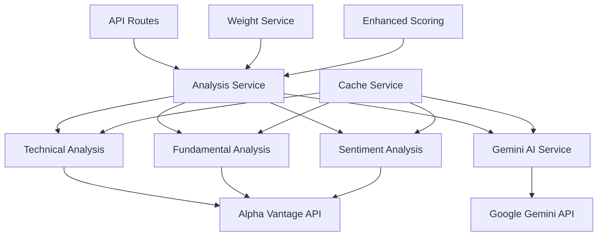
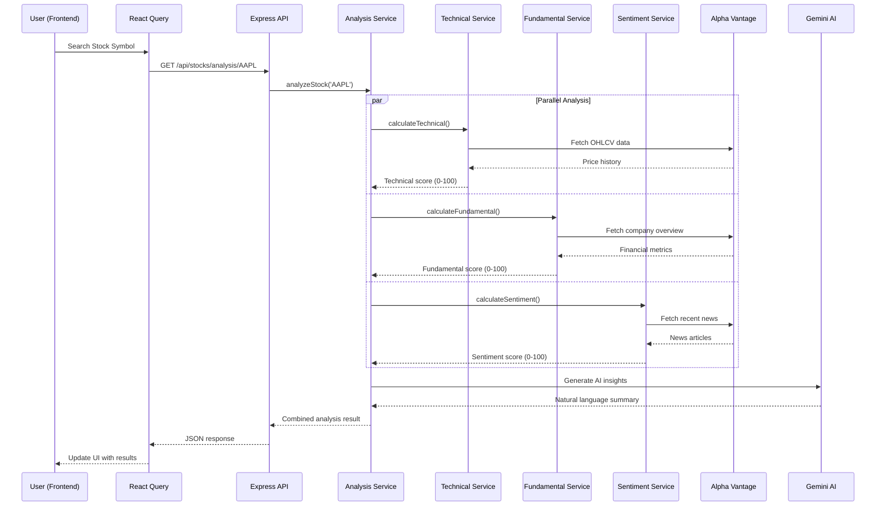
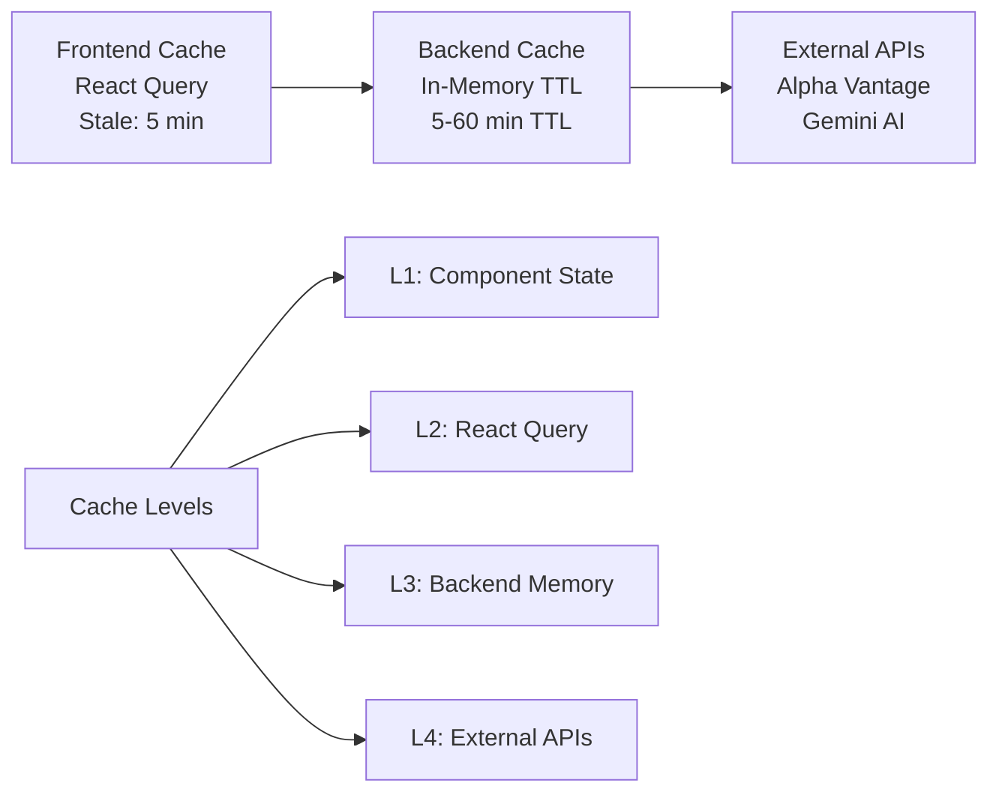
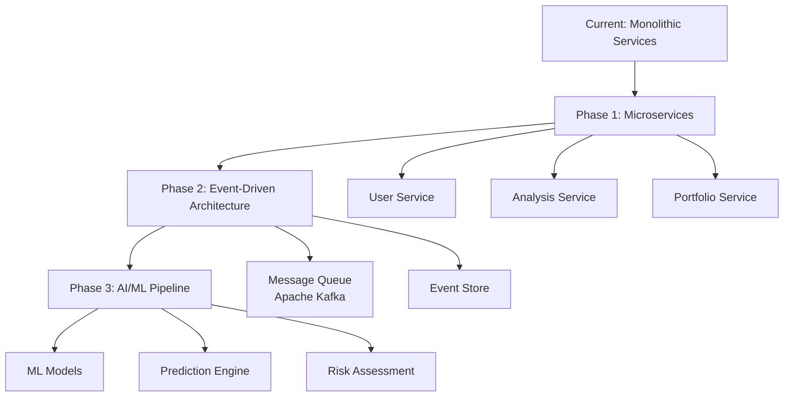

# StockViz Application Architecture

## 🏗️ Architecture Overview

**StockViz** is a full-stack stock analysis platform built with a decoupled architecture pattern featuring a React TypeScript frontend and Node.js Express backend, providing AI-powered stock analysis with real-time charts and technical indicators.

### Architecture Pattern
- **Pattern**: Full-Stack Decoupled Single Page Application (SPA)
- **Frontend**: React SPA with TypeScript + Vite
- **Backend**: Node.js REST API with Express
- **Communication**: HTTP/JSON API calls
- **Deployment**: Local development environment

---

## 🎯 Frontend Architecture

### Technology Stack
```
React 18 + TypeScript + Vite
├── UI Framework: Radix UI components
├── State Management: Zustand + React Query
├── Styling: Tailwind CSS + CSS Modules  
├── Charts: TradingView iframe widgets
├── Build Tool: Vite
├── Package Manager: npm
└── Development Server: Vite dev server
```

### Directory Structure
```
frontend/src/
├── components/              # Reusable UI components
│   ├── SimpleTradingViewChart.tsx    # TradingView integration
│   ├── TradingViewChart.tsx          # Advanced TradingView widget
│   ├── EnhancedIndicatorsPanel.tsx   # Advanced technical indicators
│   ├── IndicatorsPanel.tsx           # Basic indicators panel
│   ├── EnhancedStockAnalysis.tsx     # Enhanced analysis display
│   ├── EnhancedWeightsPanel.tsx      # Weight configuration
│   ├── AISummary.tsx                 # AI insights display
│   ├── PriceChart.tsx               # Legacy chart component
│   ├── SearchBox.tsx                # Stock symbol search
│   ├── ScoreBadge.tsx               # Score visualization
│   ├── RecommendationChip.tsx       # Recommendation display
│   ├── LoadingSpinner.tsx           # Loading states
│   ├── ErrorBoundary.tsx            # Error handling
│   ├── Layout/                      # Layout components
│   │   ├── Navbar.tsx              # Navigation bar
│   │   └── Footer.tsx              # Application footer
│   └── ui/                          # Radix UI primitives
│       ├── button.tsx              # Button component
│       ├── card.tsx                # Card layouts
│       ├── dialog.tsx              # Modal dialogs
│       ├── input.tsx               # Form inputs
│       ├── select.tsx              # Dropdown selects
│       ├── tabs.tsx                # Tab navigation
│       ├── tooltip.tsx             # Tooltips
│       ├── badge.tsx               # Status badges
│       ├── avatar.tsx              # User avatars
│       ├── skeleton.tsx            # Loading skeletons
│       └── sheet.tsx               # Slide-out panels
├── pages/                           # Route-level components
│   ├── Home.tsx                    # Landing page
│   ├── SymbolAnalysis.tsx          # Main analysis view
│   ├── Market.tsx                  # Market overview
│   ├── Portfolio.tsx               # Portfolio management
│   ├── Indicators.tsx              # Indicators configuration
│   ├── Weights.tsx                 # Analysis weights setup
│   ├── Learn.tsx                   # Educational content
│   ├── LearnPage.tsx              # Learning resources
│   └── Admin.tsx                   # Admin panel
├── lib/                            # Core utilities
│   ├── queries.ts                  # React Query API calls
│   ├── types.ts                    # TypeScript definitions
│   ├── api.ts                      # API configuration
│   ├── utils.ts                    # Helper functions
│   └── urlState.ts                 # URL state management
├── contexts/                       # React Context providers
│   ├── ThemeContext.tsx           # Theme management
│   └── AuthContext.tsx            # Authentication context
├── data/                           # Static data
│   ├── companies.ts               # Company listings
│   ├── asxCompanies.ts           # ASX stock symbols
│   ├── bseCompanies.ts           # BSE stock symbols
│   ├── nseCompanies.ts           # NSE stock symbols
│   └── nyseCompanies.ts          # NYSE stock symbols
├── store/                          # Global state management
│   └── ui.ts                      # UI state store
└── hooks/                          # Custom React hooks
    └── (custom hooks as needed)
```

### Key Frontend Features
- **🎨 Theme System**: Light/Dark mode with automatic synchronization
- **📱 Responsive Design**: Mobile-first approach with Tailwind CSS
- **🧩 Component Library**: Radix UI primitives for accessibility
- **🔒 Type Safety**: Full TypeScript coverage with strict mode
- **🗂️ State Management**: Zustand for global state, React Query for server state
- **📊 Real-time Charts**: Professional TradingView integration
- **🔍 Smart Search**: Intelligent stock symbol detection and auto-complete
- **⚡ Performance**: Optimized with React Query caching and lazy loading

---

## ⚙️ Backend Architecture

### Technology Stack
```
Node.js + Express
├── API Framework: Express.js v4.19+
├── External APIs: Alpha Vantage, Google Gemini AI
├── Caching: In-memory TTL cache with cleanup
├── Architecture: Service-oriented with dependency injection
├── Response Format: JSON REST API
├── Environment: dotenv configuration
└── HTTP Client: Axios for external API calls
```

### Directory Structure
```
backend/
├── services/                        # Business logic layer
│   ├── analysisService.js          # Main analysis orchestrator
│   ├── technicalAnalysisService.js # Technical indicators engine
│   ├── fundamentalAnalysisService.js # Company fundamentals analysis
│   ├── sentimentService.js         # News sentiment processing
│   ├── geminiService.js           # Google Gemini AI integration
│   ├── dataService.js             # External data fetching
│   ├── cacheService.js            # Intelligent caching layer
│   ├── weightService.js           # Analysis weight management
│   ├── apiTrackingService.js      # API usage monitoring
│   └── enhancedScoringService.js  # Advanced scoring algorithms
├── routes/                          # API endpoint definitions
│   └── stockRoutes.js             # Stock analysis routes
├── controllers/                     # Request handlers
│   ├── stockController.js         # Stock analysis controller
│   └── searchController.js        # Stock search controller
├── utils/                          # Utility functions
│   ├── testConnections.js         # API connection testing
│   └── test-sentiment-service.mjs # Sentiment testing utilities
├── middleware/                     # Express middleware (future)
├── config/                         # Configuration files (future)
└── server.js                      # Application entry point
```

### Service Layer Architecture


### API Endpoints
```
Stock Analysis API Endpoints:
├── GET  /api/stocks/search?query=         # Stock symbol search
├── GET  /api/stocks/trending              # Trending stocks
├── GET  /api/stocks/indicators           # Available technical indicators
├── GET  /api/stocks/analysis/:symbol     # Complete stock analysis
├── GET  /api/stocks/weights/defaults     # Default analysis weights
├── GET  /cache/status                    # Cache statistics
├── GET  /cache/clear                     # Clear cache
├── GET  /test-connections               # API health check
└── GET  /test-keys                      # API key validation
```

---

## 🔄 Data Flow Architecture

### Request Processing Flow


### Scoring Algorithm
```javascript
// Weighted scoring system
Final Score = (Technical × Weight_T) + (Fundamental × Weight_F) + (Sentiment × Weight_S)

// Default weights
Weight_Technical = 35%      // RSI, MACD, Bollinger Bands, Moving Averages
Weight_Fundamental = 40%    // P/E, ROE, Debt/Equity, Revenue Growth
Weight_Sentiment = 25%      // 7-day weighted news sentiment

// Score ranges: 0-100 for each component
Technical Score: 0-30 (Sell), 31-70 (Hold), 71-100 (Buy)
Fundamental Score: Company financial health metrics
Sentiment Score: News polarity with recency weighting
```

---

## 🗄️ Data Layer Architecture

### Caching Strategy


### Data Sources & Integration
```
External Data Sources:
├── Alpha Vantage API
│   ├── Real-time stock prices (TIME_SERIES_DAILY)
│   ├── Company fundamentals (OVERVIEW)
│   ├── Technical indicators (RSI, MACD, etc.)
│   └── Market news & sentiment
├── Google Gemini AI
│   ├── Market analysis summaries
│   ├── Investment insights
│   └── Natural language explanations
└── TradingView
    ├── Professional charting widgets
    ├── Real-time price feeds
    └── Technical analysis overlays
```

### Cache Management
```javascript
// Cache configuration
const cacheConfig = {
  stockData: { ttl: 300000 },      // 5 minutes
  fundamentals: { ttl: 3600000 },  // 1 hour
  news: { ttl: 900000 },           // 15 minutes
  analysis: { ttl: 600000 },       // 10 minutes
  maxSize: 1000,                   // Max cached items
  cleanupInterval: 300000          // Cleanup every 5 minutes
};
```

---

## 🌐 Current Deployment Architecture

### Development Environment
```
Local Development Setup:
├── Frontend Server: http://localhost:5174
│   ├── Vite Development Server
│   ├── Hot Module Reload (HMR)
│   ├── TypeScript compilation
│   └── Tailwind CSS processing
├── Backend Server: http://localhost:3001
│   ├── Express.js API server
│   ├── Nodemon auto-restart
│   ├── CORS enabled for frontend
│   └── Environment variable loading
└── External Services:
    ├── Alpha Vantage API (requires key)
    ├── Google Gemini API (requires key)
    └── TradingView widgets (public)
```

### Environment Configuration
```bash
# Backend Environment Variables
PORT=3001
NODE_ENV=development
ALPHA_VANTAGE_API_KEY=your_alpha_vantage_key
GEMINI_API_KEY=your_gemini_api_key

# Frontend Environment Variables  
VITE_API_BASE_URL=http://localhost:3001
VITE_APP_TITLE=StockViz
VITE_ENVIRONMENT=development
```

---

## 📊 Technical Specifications

### Performance Metrics
```
Current Performance Characteristics:
├── API Response Time: 2-3 seconds (with external API calls)
├── Cache Hit Rate: ~80% for repeated requests
├── Bundle Size: 
│   ├── Frontend: ~2MB (including TradingView)
│   └── Backend: ~50MB (node_modules)
├── Concurrent Users: Suitable for 10-50 simultaneous users
├── Memory Usage: ~100MB backend, ~50MB frontend
└── API Rate Limits:
    ├── Alpha Vantage: 25 calls/day (free tier)
    └── Gemini AI: 60 calls/minute
```

### Technology Versions
```json
{
  "runtime": {
    "node": "18+",
    "npm": "9+"
  },
  "frontend": {
    "react": "^18.2.0",
    "typescript": "^5.2.2", 
    "vite": "^5.0.0",
    "@radix-ui/react-*": "^1.0.0",
    "tailwindcss": "^3.3.0",
    "@tanstack/react-query": "^5.0.0"
  },
  "backend": {
    "express": "^4.19.2",
    "axios": "^1.6.0",
    "dotenv": "^16.3.1",
    "@google/generative-ai": "^0.2.1"
  }
}
```

---

## ✅ Architectural Strengths

### 🎯 Current Advantages
1. **🔄 Separation of Concerns**: Clear frontend/backend boundaries
2. **🧩 Modular Services**: Each analysis component isolated and testable
3. **🔒 Type Safety**: Comprehensive TypeScript coverage
4. **⚡ Performance**: Multi-level caching strategy reduces API costs
5. **🎨 Professional UI**: TradingView integration provides institutional-grade charts
6. **📈 Scalable Structure**: Service-oriented backend ready for horizontal scaling
7. **🌙 User Experience**: Dark/light theme with responsive design
8. **🤖 AI Integration**: Gemini AI provides intelligent market insights

### 🔧 Technical Benefits
- **Developer Experience**: Hot reload, TypeScript IntelliSense, ESLint
- **Maintainability**: Clear file structure, consistent naming conventions
- **Extensibility**: Plugin-ready architecture for new analysis modules
- **Cost Efficiency**: Intelligent caching minimizes external API calls
- **Reliability**: Graceful degradation when external services fail

---

## 🚀 Future Architecture Enhancements

### 🎯 Recommended Improvements

#### Phase 1: Production Readiness
```
1. Database Integration
   ├── PostgreSQL for user data & historical analysis
   ├── Redis for distributed caching
   └── Database migrations & seeding

2. Authentication & Authorization
   ├── JWT-based authentication
   ├── Role-based access control
   ├── API key management
   └── User preferences & portfolios

3. Testing Infrastructure
   ├── Unit tests (Jest/Vitest)
   ├── Integration tests (Supertest)
   ├── E2E tests (Playwright)
   └── API contract testing
```

#### Phase 2: Scalability & Reliability
```
4. Infrastructure
   ├── Docker containerization
   ├── Kubernetes orchestration
   ├── Load balancing (NGINX)
   └── CDN integration

5. Monitoring & Observability
   ├── Application logging (Winston)
   ├── Error tracking (Sentry)
   ├── Performance monitoring (New Relic)
   └── Health checks & alerts

6. CI/CD Pipeline
   ├── GitHub Actions workflows
   ├── Automated testing & deployment
   ├── Environment management
   └── Security scanning
```

#### Phase 3: Advanced Features
```
7. Enhanced Analytics
   ├── Portfolio backtesting engine
   ├── Risk assessment models
   ├── Predictive analytics (ML)
   └── Custom indicator builder

8. Real-time Features
   ├── WebSocket price feeds
   ├── Live portfolio tracking
   ├── Real-time alerts & notifications
   └── Collaborative analysis sharing
```

### 📊 Scalability Roadmap


---

## 📝 Development Guidelines

### Code Standards
```typescript
// TypeScript configuration
{
  "strict": true,
  "noUnusedLocals": true,
  "noUnusedParameters": true,
  "noImplicitReturns": true
}

// Naming conventions
├── Components: PascalCase (StockAnalysis.tsx)
├── Services: camelCase (analysisService.js) 
├── APIs: kebab-case (/api/stock-analysis)
├── Files: camelCase or kebab-case
└── Constants: UPPER_SNAKE_CASE
```

### Error Handling Strategy
```javascript
// Standardized error responses
{
  "error": {
    "code": "ANALYSIS_FAILED",
    "message": "Unable to analyze stock symbol",
    "details": "Invalid symbol or API unavailable",
    "timestamp": "2024-01-15T10:30:00Z",
    "requestId": "req_123456789"
  }
}
```

---

## 📖 Documentation & Resources

### Project Documentation
- **README.md**: Getting started guide
- **ARCHITECTURE.md**: This architecture overview
- **API.md**: API endpoint documentation
- **DEPLOYMENT.md**: Deployment instructions
- **CONTRIBUTING.md**: Development guidelines

### External Dependencies
- [React Documentation](https://react.dev)
- [TypeScript Handbook](https://www.typescriptlang.org/docs)
- [Vite Guide](https://vitejs.dev/guide)
- [Express.js Documentation](https://expressjs.com)
- [Alpha Vantage API](https://www.alphavantage.co/documentation)
- [Google Gemini AI](https://ai.google.dev/docs)
- [TradingView Widgets](https://www.tradingview.com/widget)

---

*This architecture document is maintained as part of the StockViz project and should be updated as the system evolves.*
