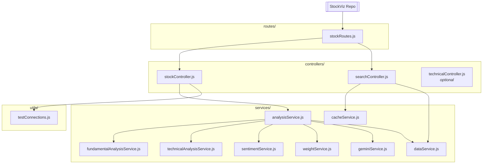
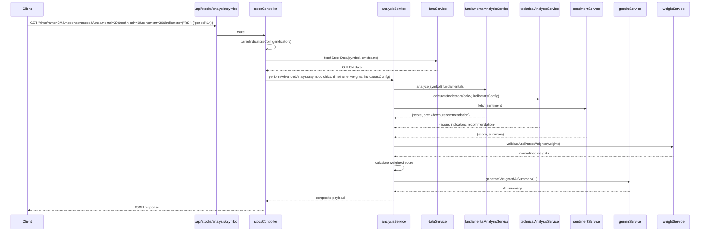
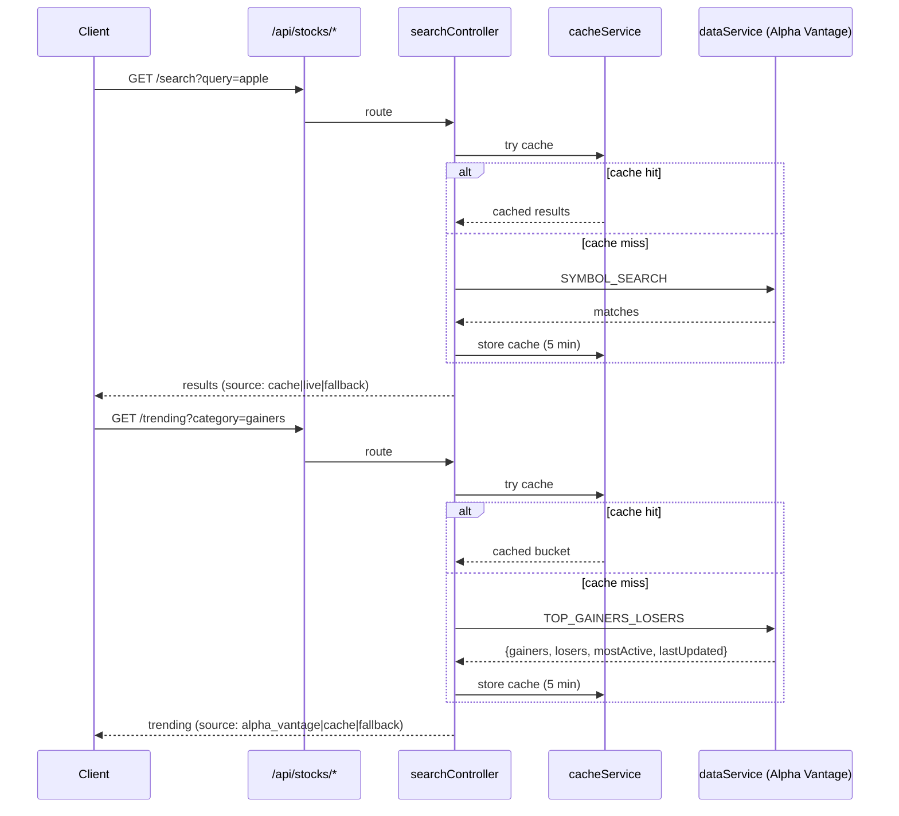

# Hybrid Stock Analysis – Architecture & Flow (Updated)

This backend analyzes stocks using **Fundamentals + Technicals + News Sentiment**, then produces a **weighted score** and a **plain-English AI summary**. The codebase is modular (controllers ↔ services) so each concern stays small, testable, and easy to extend.

---

## Project Structure

The project structure has been updated with new endpoints and enhanced features. Here's the current structure:

```
.
├── server.js
├── routes/
│   └── stockRoutes.js
├── controllers/
│   ├── stockController.js
│   └── searchController.js
│   
├── services/
│   ├── analysisService.js
│   ├── fundamentalAnalysisService.js
│   ├── technicalAnalysisService.js
│   ├── sentimentService.js
│   ├── dataService.js
│   ├── weightService.js
│   ├── geminiService.js
│   └── cacheService.js
└── utils/
    └── testConnections.js (assumed, based on server.js)
```

### Key Changes from Previous Version:
- The `technicalController.js` is provided but not integrated into the main routes; technical analysis is handled via `stockController.js` and `technicalAnalysisService.js`.
- New utility files for testing connections (e.g., `testConnections.js`) are used in `server.js`.
- Enhanced support for custom technical indicators and configuration.

### Directory Map (Flowchart)



---

## What Each File Does (Updated)

### Entry & Routing

* **`server.js`** – Boots Express, loads env, adds CORS/JSON, rate limiting, and health checks. New endpoints include:
  - `/health` – Basic health check.
  - `/test-keys` – Checks if API keys are configured.
  - `/test-connections` – Tests connections to Alpha Vantage and Gemini AI.
  - Mounts `stockRoutes` under `/api/stocks`.
* **`routes/stockRoutes.js`** – Declares `/api/stocks/*` routes:
  - `GET /indicators` – Returns available technical indicators and default config.
  - `GET /analysis/:symbol` – Main analysis endpoint with optional weights and indicators parameters.
  - `GET /search` – Search for symbols (handled by `searchController`).
  - `GET /trending` – Get trending stocks (handled by `searchController`).
  - `GET /weights/defaults` – Returns default weights and examples.

### Controllers

* **`controllers/stockController.js`**
  - Validates query parameters (`timeframe`, `mode`, `fundamental`, `technical`, `sentiment`, `indicators`).
  - Parses custom indicators configuration from query string.
  - Uses `dataService` to fetch OHLCV data.
  - Calls `analysisService` for normal or advanced analysis.
  - Provides `getTechnicalIndicators` endpoint to list available indicators.
  - Provides `getDefaultWeights` endpoint.
* **`controllers/searchController.js`**
  - Handles `GET /search?query=` – Symbol search with caching.
  - Handles `GET /trending` – Trending stocks with caching.
  - Uses `dataService` and `cacheService`.
* **`controllers/technicalController.js`** (optional)
  - Provides additional technical analysis endpoints with timeframe options.
  - Not integrated into the main routes in `stockRoutes.js`; may be used for alternative implementations.

### Services

* **`services/analysisService.js`**
  - Orchestrates normal and advanced analysis.
  - For advanced analysis, computes weighted score using `weightService`.
  - Generates AI summary via `geminiService` with fallback.
  - Includes enhanced technical scoring based on indicators.
* **`services/fundamentalAnalysisService.js`**
  - Fetches and scores fundamentals from Alpha Vantage (OVERVIEW, INCOME_STATEMENT, BALANCE_SHEET, CASH_FLOW).
  - Computes metrics: PE, PEG, PB, Revenue CAGR, ROE, margins, leverage ratios, cash flow metrics.
  - Caches results to reduce API calls.
* **`services/technicalAnalysisService.js`**
  - Calculates technical indicators (SMA, EMA, MACD, RSI, Stochastic, Bollinger Bands, ATR, OBV).
  - Supports custom configuration via `indicators` parameter.
  - Recognizes candlestick patterns (hammer, engulfing, morning/evening star).
  - Returns technical score based on indicator signals.
* **`services/sentimentService.js`**
  - Fetches news sentiment from Alpha Vantage and aggregates a score (0-100).
  - Includes fallback to neutral sentiment on errors.
* **`services/dataService.js`**
  - Fetches OHLCV data from Alpha Vantage based on timeframe (with interval mapping).
  - Generates mock data if Alpha Vantage fails or no API key.
  - Supports timeframes: 1D, 1W, 1M, 3M, 6M, 1Y, 2Y.
* **`services/weightService.js`**
  - Validates and normalizes weights to sum to 100%.
  - Provides default weights and suggests alternatives.
* **`services/geminiService.js`**
  - Generates AI-powered insights using Gemini AI.
  - Includes a comprehensive fallback response if AI is unavailable.
  - Tests connection to Gemini AI.
* **`services/cacheService.js`**
  - In-memory cache with TTL (5 minutes) for reducing API calls.

---

## Runtime Flow (End-to-End) Updated

### Advanced Analysis Request with Custom Indicators



### Search & Trending



---

## Weights & Scoring (Advanced Mode)

```
overall = (fundamental.score * wF + technical.score * wT + sentiment.score * wS) / (wF + wT + wS)
```

- `weightService` ensures weights sum to **100** (defaults: fundamental=40, technical=35, sentiment=25).
- Recommendation bands: **BUY ≥ 70**, **HOLD 50–69**, **SELL < 50**.
- `analysisService` also emits **confidenceLevel** and **riskLevel** based on score dispersion.

---

## External Data (Alpha Vantage) and Fallbacks

- **Fundamentals:** `OVERVIEW`, `INCOME_STATEMENT`, `BALANCE_SHEET`, `CASH_FLOW` – with fallback to neutral scores on failure.
- **Search:** `SYMBOL_SEARCH` – with caching and fallback.
- **Trending:** `TOP_GAINERS_LOSERS` – with caching and fallback.
- **News/Sentiment:** Alpha Vantage news feed – with fallback to neutral sentiment.
- **OHLCV Data:** Fetched from Alpha Vantage with mock data fallback.
- **AI Insights:** Gemini AI with detailed fallback summary.

The code handles **rate limiting** and API failures gracefully by returning cached data or fallback responses with `source` and `notes` fields.

---

## Custom Technical Indicators Configuration

A new feature allows clients to customize which technical indicators to calculate and their parameters via the `indicators` query parameter. For example:

- `indicators={"RSI":{"period":14},"MACD":{"fastPeriod":12,"slowPeriod":26,"signalPeriod":9}}`
- `indicators={"patterns":{"enabled":false}}` to disable pattern recognition.

This is parsed in `stockController.js` and passed to `technicalAnalysisService.js`.

---

## Example Outputs (Shape)

**Advanced Analysis with Custom Indicators**

```json
{
  "status": "success",
  "symbol": "AAPL",
  "analysis": {
    "mode": "advanced",
    "timeframe": "3M",
    "timestamp": "2025-09-08T12:00:00Z",
    "fundamental": { "score": 72, "breakdown": { "valuation": 75, ... }, "recommendation": "BUY", "weight": "30%" },
    "technical": { "score": 65, "indicators": { "RSI": [...], "MACD": {...} }, "recommendation": "HOLD", "configuration": {"RSI":{"period":14}} },
    "sentiment": { "score": 58, "summary": "...", "weight": "30%" },
    "overall": { "score": 65, "recommendation": "HOLD" },
    "aiInsights": { "summary": "- Overall HOLD...\n- Fundamentals strong..." },
    "meta": {
      "dataPoints": 90,
      "weightsUsed": { "fundamental": 30, "technical": 40, "sentiment": 30 },
      "confidenceLevel": "medium",
      "riskLevel": "low",
      "dataSource": "Alpha Vantage"
    }
  }
}
```

**Technical Indicators Endpoint**

```json
{
  "status": "success",
  "availableIndicators": {
    "trend": ["SMA", "EMA", "MACD", "ADX", "Ichimoku"],
    "momentum": ["RSI", "Stochastic", "CCI", "WilliamsR"],
    "volatility": ["BollingerBands", "ATR", "StandardDeviation"],
    "volume": ["OBV", "VolumeSMA", "MoneyFlowIndex"]
  },
  "defaultConfig": {
    "SMA": { "period": 20 },
    "EMA": { "period": 20 },
    "MACD": { "fastPeriod": 12, "slowPeriod": 26, "signalPeriod": 9 },
    "RSI": { "period": 14 },
    "Stochastic": { "period": 14, "signalPeriod": 3 },
    "BollingerBands": { "period": 20, "stdDev": 2 },
    "ATR": { "period": 14 }
  },
  "description": "Available technical indicators for advanced analysis"
}
```

**Default Weights Endpoint**

```json
{
  "status": "success",
  "defaultWeights": { "fundamental": 40, "technical": 35, "sentiment": 25 },
  "description": {
    "fundamental": "Company financials, ratios, and intrinsic value",
    "technical": "Price patterns, indicators, and market trends",
    "sentiment": "News sentiment, social media, and market psychology"
  },
  "examples": [
    { "name": "Conservative", "fundamental": 50, "technical": 30, "sentiment": 20 },
    { "name": "Technical Trader", "fundamental": 20, "technical": 60, "sentiment": 20 },
    { "name": "Sentiment Focus", "fundamental": 30, "technical": 25, "sentiment": 45 },
    { "name": "Balanced", "fundamental": 40, "technical": 35, "sentiment": 25 }
  ]
}
```

---

## Extensibility Notes

- Add new indicators in `technicalAnalysisService` without touching controllers.
- Tweak category weights (valuation/growth/...) in `fundamentalAnalysisService`.
- Swap/augment the news source inside `sentimentService` without changing public shapes.
- The AI summary is pluggable—`geminiService` can be replaced by any LLM wrapper.
- Custom indicators configuration allows clients to tailor technical analysis.

---
