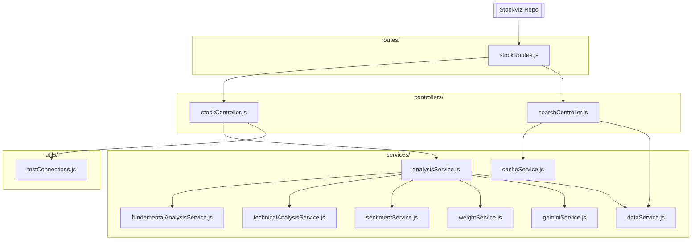
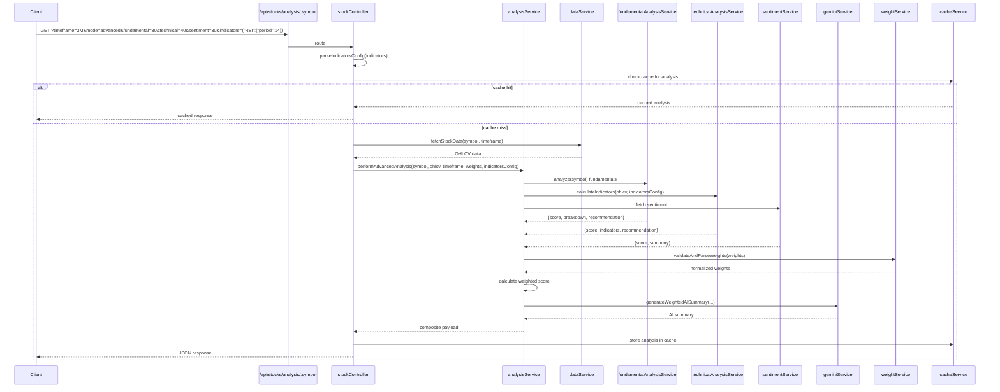
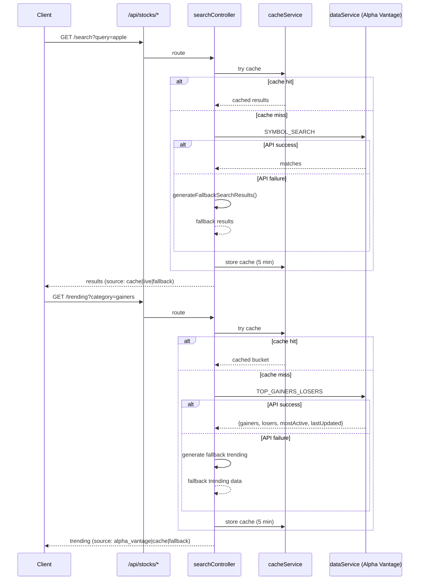

# Hybrid Stock Analysis – Architecture & Flow (Updated)

This backend analyzes stocks using **Fundamentals + Technicals + News Sentiment**, then produces a **weighted score** and a **plain-English AI summary**. The codebase is modular (controllers ↔ services) so each concern stays small, testable, and easy to extend.

---

## Project Structure

The project structure has been updated with new endpoints and enhanced features. Here's the current structure:

```
.
├── server.js
├── routes/
│   └── stockRoutes.js
├── controllers/
│   ├── stockController.js
│   └── searchController.js
│   
├── services/
│   ├── analysisService.js
│   ├── fundamentalAnalysisService.js
│   ├── technicalAnalysisService.js
│   ├── sentimentService.js
│   ├── dataService.js
│   ├── weightService.js
│   ├── geminiService.js
│   └── cacheService.js
└── utils/
    └── testConnections.js
```

### Key Updates:
- No `technicalController.js` exists in the provided code - technical analysis is handled directly through `stockController.js` and `technicalAnalysisService.js`
- Enhanced cache management with additional methods in `cacheService.js`
- Improved error handling and fallback mechanisms across all services
- More comprehensive technical indicator support with pattern recognition

### Directory Map (Flowchart)



---

## What Each File Does (Updated)

### Entry & Routing

* **`server.js`** – Boots Express, loads env, adds CORS/JSON, rate limiting, and health checks. Enhanced endpoints include:
  - `/health` – Basic health check.
  - `/test-keys` – Checks if API keys are configured.
  - `/test-connections` – Tests connections to Alpha Vantage and Gemini AI.
  - `/cache/status` – Returns cache statistics.
  - `/cache/clear` – Clears all cached items.
  - `/cache/cleanup` – Removes expired cache entries.
  - Mounts `stockRoutes` under `/api/stocks`.

* **`routes/stockRoutes.js`** – Declares `/api/stocks/*` routes:
  - `GET /indicators` – Returns available technical indicators and default config.
  - `GET /analysis/:symbol` – Main analysis endpoint with optional weights and indicators parameters.
  - `GET /search` – Search for symbols (handled by `searchController`).
  - `GET /trending` – Get trending stocks (handled by `searchController`).
  - `GET /weights/defaults` – Returns default weights and examples.

### Controllers

* **`controllers/stockController.js`**
  - Validates query parameters (`timeframe`, `mode`, `fundamental`, `technical`, `sentiment`, `indicators`).
  - Parses custom indicators configuration from query string with validation.
  - Uses `dataService` to fetch OHLCV data.
  - Calls `analysisService` for normal or advanced analysis.
  - Provides `getTechnicalIndicators` endpoint to list available indicators.
  - Provides `getDefaultWeights` endpoint with examples and descriptions.

* **`controllers/searchController.js`**
  - Handles `GET /search?query=` – Symbol search with caching and fallback to popular stocks.
  - Handles `GET /trending` – Trending stocks with caching and name enrichment option.
  - Uses `dataService` and `cacheService` with comprehensive error handling.

### Services

* **`services/analysisService.js`**
  - Orchestrates normal and advanced analysis with enhanced technical scoring.
  - For advanced analysis, computes weighted score using `weightService`.
  - Generates comprehensive AI summary via `geminiService` with detailed fallback.
  - Includes pattern-aware technical scoring and risk assessment.

* **`services/fundamentalAnalysisService.js`**
  - Fetches and scores fundamentals from Alpha Vantage (OVERVIEW, INCOME_STATEMENT, BALANCE_SHEET, CASH_FLOW).
  - Computes comprehensive metrics: PE, PEG, PB, Revenue CAGR, ROE, margins, leverage ratios, cash flow metrics.
  - Includes robust error handling with neutral fallback scores.

* **`services/technicalAnalysisService.js`**
  - Calculates technical indicators using `@thuantan2060/technicalindicators` library.
  - Supports SMA, EMA, MACD, RSI, Stochastic, Bollinger Bands, ATR, OBV.
  - Recognizes candlestick patterns (hammer, engulfing, morning/evening star) with confidence scoring.
  - Supports custom configuration via `indicators` parameter.

* **`services/sentimentService.js`**
  - Fetches news sentiment from Alpha Vantage NEWS_SENTIMENT endpoint.
  - Aggregates a score (0-100) with headline samples for transparency.
  - Includes fallback to neutral sentiment on errors.

* **`services/dataService.js`**
  - Fetches OHLCV data from Alpha Vantage with timeframe-to-interval mapping.
  - Generates realistic mock data if Alpha Vantage fails or no API key.
  - Supports timeframes: 1D, 1W, 1M, 3M, 6M, 1Y, 2Y with appropriate data point limits.

* **`services/weightService.js`**
  - Validates and normalizes weights to sum to 100%.
  - Provides default weights and suggests alternative strategies.
  - Includes `getWeightingStyle()` method to describe the weighting approach.

* **`services/geminiService.js`**
  - Generates AI-powered insights using Google Gemini 2.5 Flash.
  - Includes a comprehensive fallback response with detailed analysis structure.
  - Tests connection to Gemini AI with proper error handling.

* **`services/cacheService.js`**
  - Enhanced in-memory cache with TTL (5 minutes) and additional methods:
    - `stats()` - returns cache statistics (total, valid, expired items)
    - `cleanup()` - removes expired entries
    - `size()` - returns current cache size

---

## Runtime Flow (End-to-End) Updated

### Advanced Analysis Request with Custom Indicators



### Search & Trending



---

## Weights & Scoring (Advanced Mode)

```
overall = (fundamental.score * wF + technical.score * wT + sentiment.score * wS) / (wF + wT + wS)
```

- `weightService` ensures weights sum to **100** (defaults: fundamental=40, technical=35, sentiment=25).
- Recommendation bands: **BUY ≥ 70**, **HOLD 50-69**, **SELL < 50**.
- `analysisService` also emits **confidenceLevel** and **riskLevel** based on score dispersion.
- Technical scoring considers multiple indicator signals (RSI, MACD, moving averages, Bollinger Bands)

---

## External Data (Alpha Vantage) and Fallbacks

- **Fundamentals:** `OVERVIEW`, `INCOME_STATEMENT`, `BALANCE_SHEET`, `CASH_FLOW` – with comprehensive fallback to neutral scores on failure.
- **Search:** `SYMBOL_SEARCH` – with caching and fallback to popular stocks list.
- **Trending:** `TOP_GAINERS_LOSERS` – with caching and fallback to generated data.
- **News/Sentiment:** Alpha Vantage NEWS_SENTIMENT – with fallback to neutral sentiment.
- **OHLCV Data:** Fetched from Alpha Vantage with realistic mock data fallback.
- **AI Insights:** Gemini AI with detailed fallback summary that mimics full analysis structure.

The code handles **rate limiting** and API failures gracefully by returning cached data or fallback responses with `source` and `notes` fields.

---

## Cache Management

The enhanced cache service includes:
- Automatic expiration after 5 minutes
- Manual cleanup of expired entries via `/cache/cleanup`
- Cache statistics via `/cache/status`
- Manual cache clearing via `/cache/clear`
- Cache keys incorporate all analysis parameters for precise matching

---

## Custom Technical Indicators Configuration

Clients can customize which technical indicators to calculate and their parameters via the `indicators` query parameter. Examples:

- `indicators={"RSI":{"period":14},"MACD":{"fastPeriod":12,"slowPeriod":26,"signalPeriod":9}}`
- `indicators={"patterns":{"enabled":false}}` to disable pattern recognition
- `indicators={"SMA":{"period":50},"BollingerBands":{"period":20,"stdDev":2}}`

This is parsed in `stockController.js` with validation and passed to `technicalAnalysisService.js`.

---

## Timeframe Options

The system supports multiple timeframe options with appropriate data handling:

| Timeframe | Description | Data Points | Alpha Vantage Interval |
|-----------|-------------|-------------|---------------------|
| 1D        | 1 Day - Intraday data | 96 | 5min |
| 1W        | 1 Week - Short-term trends | 56 | 30min |
| 1M        | 1 Month - Medium-term trends (default) | 30 | daily |
| 3M        | 3 Months - Quarter analysis | 90 | daily |
| 6M        | 6 Months - Half-year trends | 180 | daily |
| 1Y        | 1 Year - Annual performance | 52 | weekly |
| 2Y        | 2 Years - Long-term trends | 104 | weekly |

---

## Example Outputs (Enhanced)

**Advanced Analysis with Custom Indicators**

```json
{
  "status": "success",
  "symbol": "AAPL",
  "analysis": {
    "mode": "advanced",
    "timeframe": "3M",
    "timestamp": "2025-09-08T12:00:00Z",
    "fundamental": {
      "score": 72,
      "recommendation": "BUY",
      "breakdown": {
        "valuation": 75,
        "growth": 68,
        "profitability": 80,
        "leverage": 65,
        "cashflow": 70
      },
      "metrics": {
        "pe": 25.4,
        "peg": 1.2,
        "revenueCAGR": 8.5,
        "returnOnEquity": 22.1
      },
      "weight": "30%",
      "source": "Alpha Vantage"
    },
    "technical": {
      "score": 65,
      "recommendation": "HOLD",
      "indicators": {
        "RSI": [45.2, 47.8, 52.1],
        "MACD": {
          "macd": [-0.25, -0.18, -0.12],
          "signal": [-0.30, -0.28, -0.25],
          "histogram": [0.05, 0.10, 0.13]
        }
      },
      "patterns": [
        {
          "pattern": "Hammer",
          "direction": "bullish",
          "confidence": 75
        }
      ],
      "configuration": {"RSI":{"period":14}},
      "weight": "40%"
    },
    "sentiment": {
      "score": 58,
      "summary": "Avg sentiment score 0.16 across 42 articles.",
      "headlines": [
        {"title": "Apple announces new product", "publisher": "CNBC", "score": "0.21"},
        {"title": "Analysts cautious on Apple outlook", "publisher": "Bloomberg", "score": "0.12"}
      ],
      "weight": "30%",
      "source": "Alpha Vantage News"
    },
    "overall": {
      "score": 65,
      "recommendation": "HOLD"
    },
    "aiInsights": {
      "summary": "COMPREHENSIVE ANALYSIS REPORT FOR AAPL\n\nEXECUTIVE SUMMARY:\nBased on our multi-factor analysis, AAPL presents a mixed investment opportunity...\n\nFUNDAMENTAL ASSESSMENT:\nFundamental Score: 72/100\nThe company's financial health shows strong characteristics..."
    },
    "meta": {
      "dataPoints": 90,
      "weightsUsed": {
        "fundamental": 30,
        "technical": 40,
        "sentiment": 30
      },
      "confidenceLevel": "medium",
      "riskLevel": "low",
      "dataSource": "Alpha Vantage"
    }
  }
}
```

**Technical Indicators Endpoint**

```json
{
  "status": "success",
  "availableIndicators": {
    "trend": ["SMA", "EMA", "MACD", "ADX", "Ichimoku"],
    "momentum": ["RSI", "Stochastic", "CCI", "WilliamsR"],
    "volatility": ["BollingerBands", "ATR", "StandardDeviation"],
    "volume": ["OBV", "VolumeSMA", "MoneyFlowIndex"]
  },
  "defaultConfig": {
    "SMA": { "period": 20 },
    "EMA": { "period": 20 },
    "MACD": {
      "fastPeriod": 12,
      "slowPeriod": 26,
      "signalPeriod": 9
    },
    "RSI": { "period": 14 },
    "Stochastic": {
      "period": 14,
      "signalPeriod": 3
    },
    "BollingerBands": {
      "period": 20,
      "stdDev": 2
    },
    "ATR": { "period": 14 }
  },
  "description": "Available technical indicators for advanced analysis"
}
```

**Default Weights Endpoint**

```json
{
  "status": "success",
  "defaultWeights": {
    "fundamental": 40,
    "technical": 35,
    "sentiment": 25
  },
  "description": {
    "fundamental": "Company financials, ratios, and intrinsic value",
    "technical": "Price patterns, indicators, and market trends",
    "sentiment": "News sentiment, social media, and market psychology"
  },
  "examples": [
    {
      "name": "Conservative",
      "fundamental": 50,
      "technical": 30,
      "sentiment": 20
    },
    {
      "name": "Technical Trader",
      "fundamental": 20,
      "technical": 60,
      "sentiment": 20
    },
    {
      "name": "Sentiment Focus",
      "fundamental": 30,
      "technical": 25,
      "sentiment": 45
    },
    {
      "name": "Balanced",
      "fundamental": 40,
      "technical": 35,
      "sentiment": 25
    }
  ]
}
```

---

## Extensibility Notes

- Add new indicators in `technicalAnalysisService` without touching controllers.
- Tweak category weights (valuation/growth/...) in `fundamentalAnalysisService`.
- Swap/augment the news source inside `sentimentService` without changing public shapes.
- The AI summary is pluggable—`geminiService` can be replaced by any LLM wrapper.
- Custom indicators configuration allows clients to tailor technical analysis.
- Cache system can be extended to use Redis or other persistent stores.
- Additional data providers can be added to `dataService` with fallback handling.